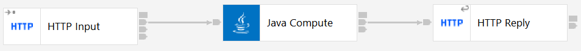

# ace-user-defined-policies
ACE user-defined policies examples based on the ACE v12 tutorial "Using a Java User-Defined Node which reads a User-Defined Policy"

## JavaCompute node example

The ExampleAppUsingJCN project contains a simple flow that listens on an HTTP URL and responds with an XML message
with the contents of one of the values provided by the user-defined policy named `ExampleUserDefinedPolicy` in the
`ExampleUserDefinedPolicyProject`. The flows looks as follows:



and the JavaCompute node [implementation](ExampleAppUsingJCNJava/com/ibm/dev/ExampleAppUsingJCN_JavaCompute.java)
reads in from the [policy](ExampleUserDefinedPolicyProject/ExampleUserDefinedPolicy.policyxml) to create responses
of the form
```
<ResponseMessage>
  <UserDefinedPolicyProject>ExampleUserDefinedPolicyProject</UserDefinedPolicyProject>
  <UserDefinedPolicy>ExampleUserDefinedPolicy</UserDefinedPolicy>
  <UserDefinedPolicyProperty>Property1</UserDefinedPolicyProperty>
  <UserDefinedPolicyPropertyValue>ValueOfOne</UserDefinedPolicyPropertyValue>
</ResponseMessage>
```

### Running the code locally

This repo should be cloned locally using the ACE v12 toolkit "git" perspective, ensuring that the checkbox labelled
`Immport all existing Eclipse projects after clone finishes` is selected. Once this is complete, the policy and 
application can be deployed to the server. `ExampleUserDefinedPolicyProject/ExampleUserDefinedPolicyProject.bar` and 
`ExampleAppUsingJCN/ExampleAppUsingJCN.bar` should be deployed, and then curl or a web browser can be pointed at
http://localhost:7800/ExampleFlowUsingJCN to validate the results.

### Policy update

Once the initial test has succeeded, the policy can be changed and redeployed, with the changes being visible 
immediately. Modifying the value of `Property1` to be `SecondValueOfOne`, followed by rebuilding the BAR file and
redeploying, should cause the output to change to
```
<ResponseMessage>
  <UserDefinedPolicyProject>ExampleUserDefinedPolicyProject</UserDefinedPolicyProject>
  <UserDefinedPolicy>ExampleUserDefinedPolicy</UserDefinedPolicy>
  <UserDefinedPolicyProperty>Property1</UserDefinedPolicyProperty>
  <UserDefinedPolicyPropertyValue>ValueOfOne</UserDefinedPolicyPropertyValue>
</ResponseMessage>
```
for the next invocation.

Note that not all policies are read dynamically: JDBC policies, for example, require a server restart. 

Deploying the same policy twice without changing the values will lead to messages such as
```
2023-05-08 16:59:24.218404: BIP9339W: The values defined in the policy(s) 'ExampleUserDefinedPolicy' in policy project 'ExampleUserDefinedPolicyProject' match the values of the existing policy(s). Any deployed resources using the policy(s) will not be affected by the redeploy of the policy project. 
```
which are harmless, showing only that the server has noticed that nothing needs to be done.
